# 图片处理管理工具 - 技术架构图

## 1. 整体架构图

### 1.1 分层架构

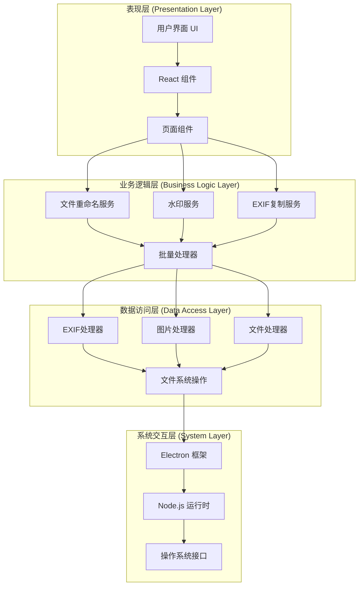

### 1.2 技术栈架构

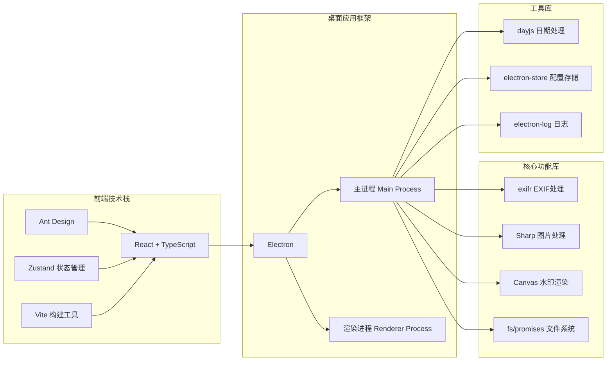

## 2. Electron 进程架构

### 2.1 主进程与渲染进程架构

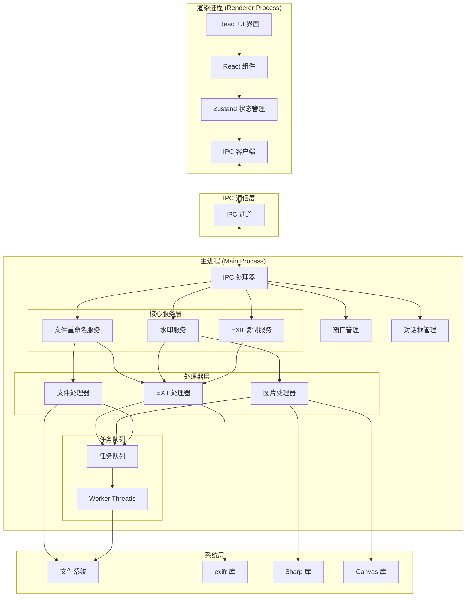

### 2.2 IPC 通信架构

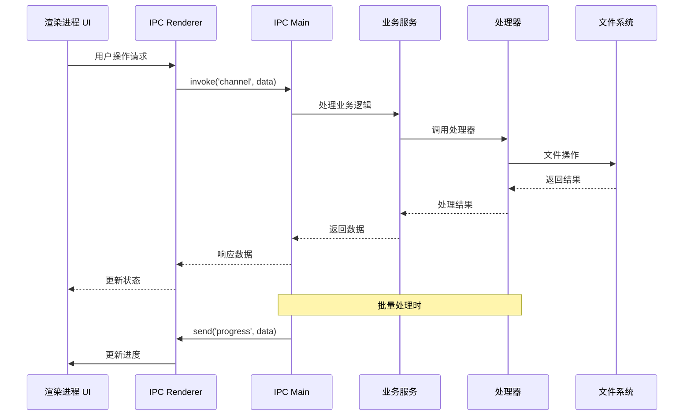

## 3. 功能模块架构

### 3.1 文件重命名功能架构

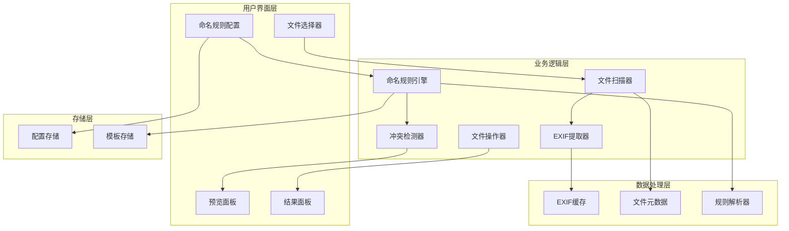

### 3.2 水印功能架构

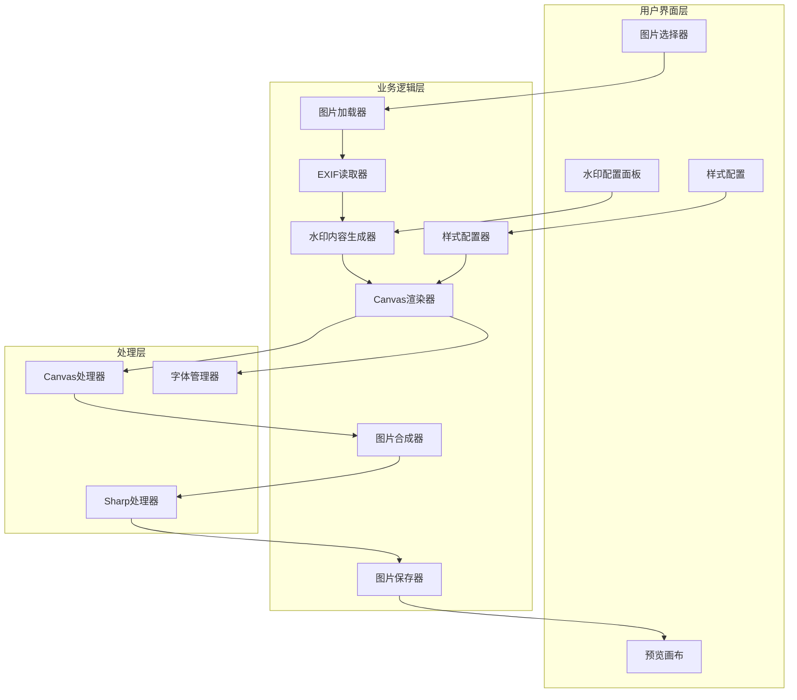

### 3.3 EXIF复制功能架构

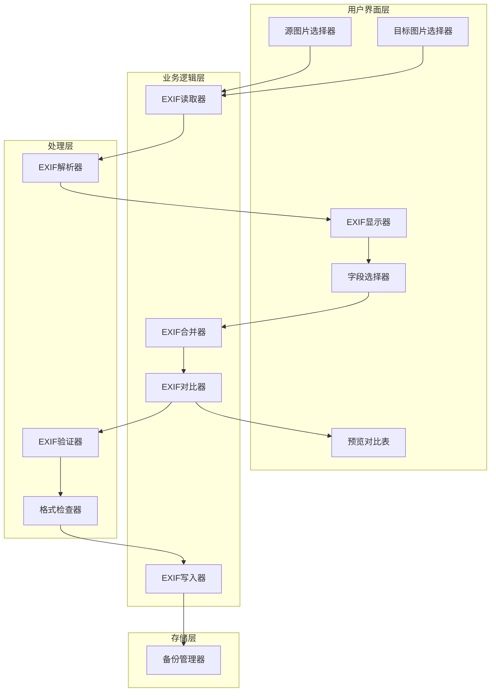

## 4. 数据流架构

### 4.1 文件重命名数据流

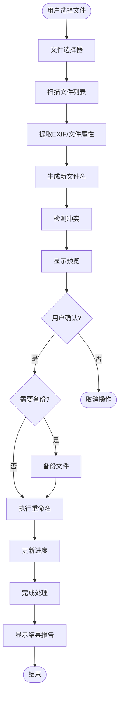

### 4.2 水印添加数据流

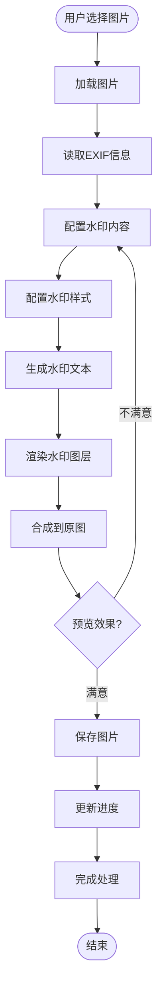

### 4.3 EXIF复制数据流

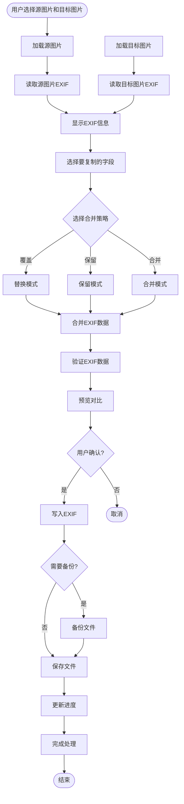

## 5. 系统部署架构

### 5.1 应用打包架构

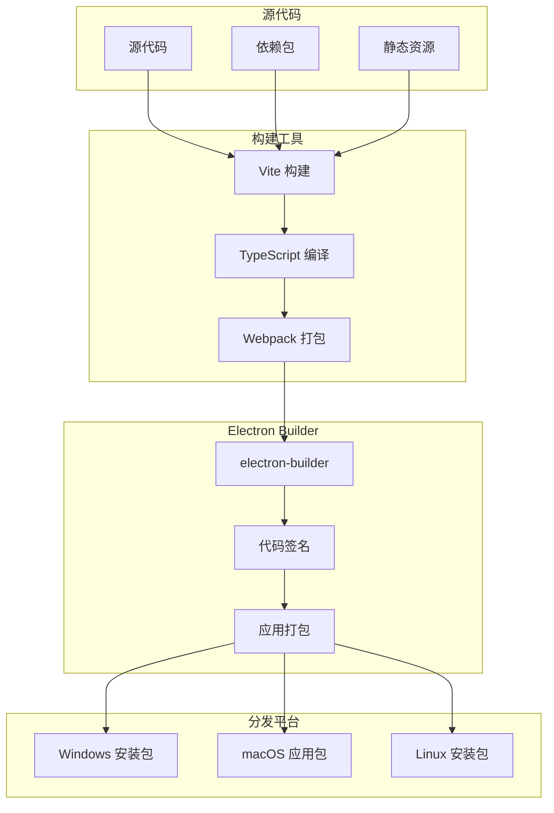

### 5.2 运行时架构

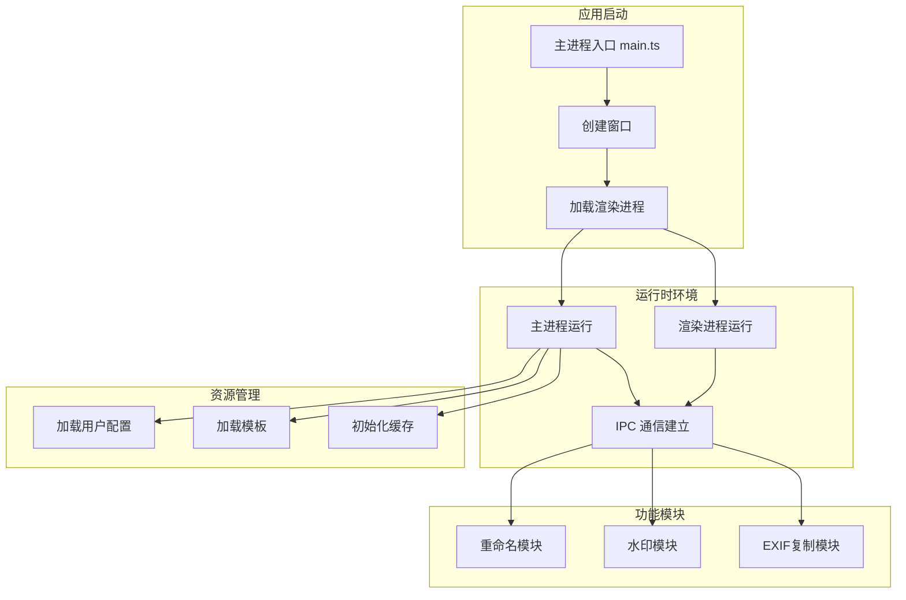

## 6. 模块依赖关系图

### 6.1 核心模块依赖

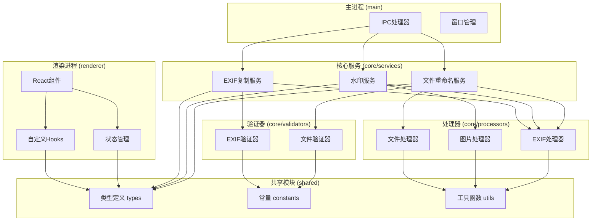

## 7. 技术栈层次图

### 7.1 完整技术栈

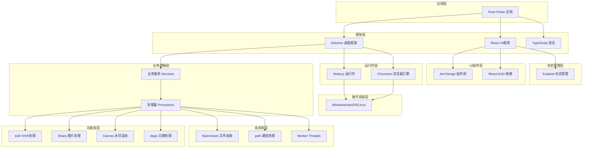

## 8. 数据存储架构

### 8.1 存储结构

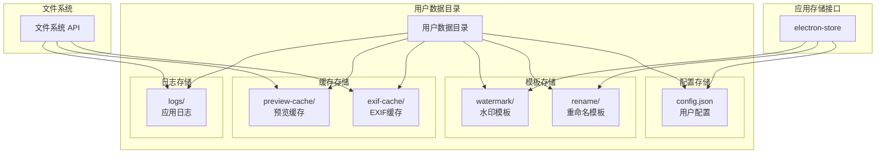

## 9. 性能优化架构

### 9.1 并发处理架构

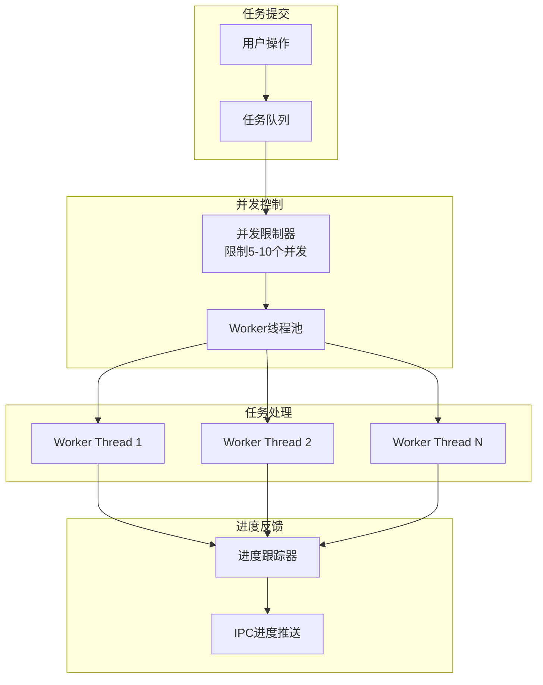

## 10. 安全架构

### 10.1 安全防护层次

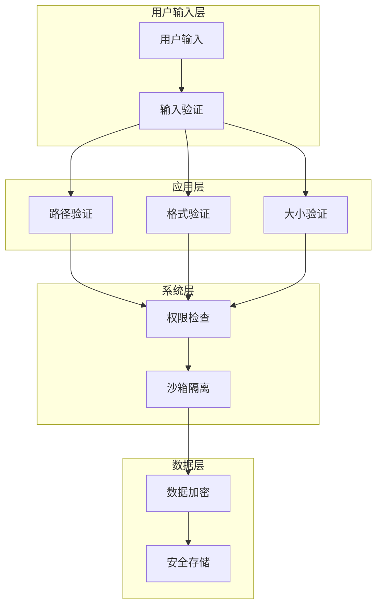

---

**文档版本**：v1.0  
**创建日期**：2026年1月9日  
**最后更新**：2026年1月9日

**说明**：本文档使用 Mermaid 图表语法，可以在支持 Mermaid 的 Markdown 查看器中查看（如 GitHub、GitLab、VS Code 的 Markdown Preview Enhanced 插件等）。

