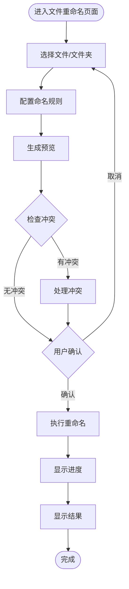
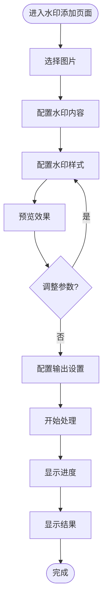
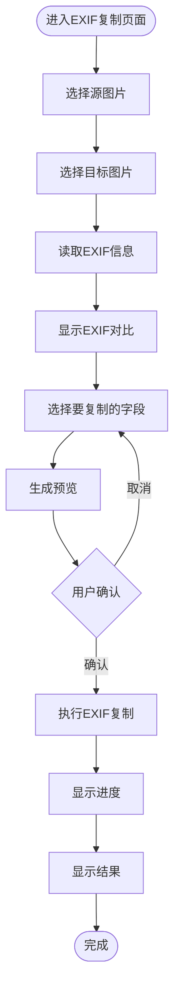

# 图片处理管理工具 - 页面示意图

## 1. 主页面/导航页面

### 1.1 页面布局示意图

```
┌─────────────────────────────────────────────────────────────────────────┐
│  Pixel Porter                                    [设置] [帮助] [最小化][×] │
├─────────────────────────────────────────────────────────────────────────┤
│                                                                         │
│  ┌─────────────────────────────────────────────────────────────────┐   │
│  │                                                                 │   │
│  │                    📷 Pixel Porter                            │   │
│  │                                                                 │   │
│  │              图片处理管理工具                                    │   │
│  │                                                                 │   │
│  └─────────────────────────────────────────────────────────────────┘   │
│                                                                         │
│  ┌──────────────┐  ┌──────────────┐  ┌──────────────┐                 │
│  │              │  │              │  │              │                 │
│  │  📝 文件重命名 │  │  🎨 添加水印  │  │  📋 EXIF复制  │                 │
│  │              │  │              │  │              │                 │
│  │  批量修改图片 │  │  根据EXIF信息 │  │  复制EXIF信息 │                 │
│  │  文件名称     │  │  创建水印版本 │  │  到目标图片   │                 │
│  │              │  │              │  │              │                 │
│  └──────────────┘  └──────────────┘  └──────────────┘                 │
│                                                                         │
│  ┌─────────────────────────────────────────────────────────────────┐   │
│  │  最近使用的模板                                                  │   │
│  │  ┌──────────┐  ┌──────────┐  ┌──────────┐                      │   │
│  │  │ 模板1    │  │ 模板2    │  │ 模板3    │                      │   │
│  │  └──────────┘  └──────────┘  └──────────┘                      │   │
│  └─────────────────────────────────────────────────────────────────┘   │
│                                                                         │
│  ┌─────────────────────────────────────────────────────────────────┐   │
│  │  快速开始                                                        │   │
│  │  • 选择功能模块开始处理图片                                       │   │
│  │  • 查看帮助文档了解详细功能                                       │   │
│  └─────────────────────────────────────────────────────────────────┘   │
│                                                                         │
└─────────────────────────────────────────────────────────────────────────┘
```

### 1.2 页面组件说明

- **顶部标题栏**：应用名称和窗口控制按钮
- **功能卡片区域**：三个主要功能模块的入口
- **最近使用模板**：快速访问最近使用的命名规则和水印模板
- **快速开始提示**：引导用户开始使用

## 2. 文件重命名页面

### 2.1 页面布局示意图

```
┌─────────────────────────────────────────────────────────────────────────┐
│  Pixel Porter - 文件重命名                    [← 返回]  [设置] [帮助] [×] │
├─────────────────────────────────────────────────────────────────────────┤
│                                                                         │
│  ┌─ 步骤 1: 选择文件 ───────────────────────────────────────────────┐  │
│  │                                                                  │  │
│  │  [选择文件]  [选择文件夹]  [拖拽文件到此处]                        │  │
│  │                                                                  │  │
│  │  已选择文件: 3 个文件                                             │  │
│  │  ┌──────────────────────────────────────────────────────────┐   │  │
│  │  │ ✓ IMG_001.jpg          (2.5 MB)  [移除]                  │   │  │
│  │  │ ✓ DSC_1234.jpg         (3.1 MB)  [移除]                  │   │  │
│  │  │ ✓ Photo_2024.jpg       (1.8 MB)  [移除]                  │   │  │
│  │  └──────────────────────────────────────────────────────────┘   │  │
│  │                                                                  │  │
│  │  ☑ 递归处理子文件夹                                               │  │
│  │                                                                  │  │
│  └──────────────────────────────────────────────────────────────────┘  │
│                                                                         │
│  ┌─ 步骤 2: 配置命名规则 ──────────────────────────────────────────┐  │
│  │                                                                  │  │
│  │  命名规则: ○ 基于EXIF拍摄时间  ○ 基于文件创建时间                │  │
│  │            ○ 基于原始文件名    ○ 组合命名规则                    │  │
│  │                                                                  │  │
│  │  日期时间格式: [YYYYMMDD_HHMMSS        ▼]                       │  │
│  │  分隔符:      [_ (下划线)              ▼]                       │  │
│  │                                                                  │  │
│  │  组合规则配置:                                                    │  │
│  │  ┌──────────────────────────────────────────────────────────┐   │  │
│  │  │ {date}_{time}_{original}                                  │   │  │
│  │  └──────────────────────────────────────────────────────────┘   │  │
│  │  可用变量: {date} {time} {original} {index}                     │  │
│  │                                                                  │  │
│  │  高级选项:                                                        │  │
│  │  ☑ 自动添加序号（处理冲突）                                      │  │
│  │  ☑ 文件名长度限制: [50] 字符                                      │  │
│  │                                                                  │  │
│  │  [保存为模板]  [加载模板 ▼]                                      │  │
│  │                                                                  │  │
│  └──────────────────────────────────────────────────────────────────┘  │
│                                                                         │
│  ┌─ 步骤 3: 预览和确认 ────────────────────────────────────────────┐  │
│  │                                                                  │  │
│  │  [生成预览]                                                      │  │
│  │                                                                  │  │
│  │  ┌──────────────────────────────────────────────────────────┐   │  │
│  │  │ 原文件名              →  新文件名             状态       │   │  │
│  │  ├──────────────────────────────────────────────────────────┤   │  │
│  │  │ IMG_001.jpg         →  20240115_143022.jpg    ✓         │   │  │
│  │  │ DSC_1234.jpg        →  20240115_143025.jpg    ✓         │   │  │
│  │  │ Photo_2024.jpg      →  20240115_143030.jpg    ⚠ 冲突    │   │  │
│  │  └──────────────────────────────────────────────────────────┘   │  │
│  │                                                                  │  │
│  │  处理选项:                                                        │  │
│  │  ☑ 执行前备份原文件                                               │  │
│  │  备份位置: [原目录/backup]  [浏览...]                            │  │
│  │                                                                  │  │
│  │  [取消]                                    [开始重命名]           │  │
│  │                                                                  │  │
│  └──────────────────────────────────────────────────────────────────┘  │
│                                                                         │
└─────────────────────────────────────────────────────────────────────────┘
```

### 2.2 处理进度页面

```
┌─────────────────────────────────────────────────────────────────────────┐
│  正在处理...                                    [取消]                   │
├─────────────────────────────────────────────────────────────────────────┤
│                                                                         │
│  ┌─────────────────────────────────────────────────────────────────┐   │
│  │                                                                 │   │
│  │  处理进度: ████████████████████░░░░░░  65%                      │   │
│  │                                                                 │   │
│  │  当前处理: IMG_001.jpg                                          │   │
│  │  已完成: 2 / 3 个文件                                           │   │
│  │                                                                 │   │
│  └─────────────────────────────────────────────────────────────────┘   │
│                                                                         │
│  ┌─ 处理日志 ────────────────────────────────────────────────────┐   │
│  │                                                                  │  │
│  │  [12:30:15] ✓ IMG_001.jpg 重命名成功                            │  │
│  │  [12:30:16] ✓ DSC_1234.jpg 重命名成功                            │  │
│  │  [12:30:17] ⚠ Photo_2024.jpg 文件名冲突，已自动添加序号          │  │
│  │  [12:30:18] 正在处理...                                         │  │
│  │                                                                  │  │
│  └──────────────────────────────────────────────────────────────────┘  │
│                                                                         │
└─────────────────────────────────────────────────────────────────────────┘
```

### 2.3 处理结果页面

```
┌─────────────────────────────────────────────────────────────────────────┐
│  处理完成                                    [关闭]  [查看详情]           │
├─────────────────────────────────────────────────────────────────────────┤
│                                                                         │
│  ┌─────────────────────────────────────────────────────────────────┐   │
│  │                                                                 │   │
│  │  ✓ 处理完成！                                                    │   │
│  │                                                                 │   │
│  │  统计信息:                                                       │   │
│  │  • 成功: 3 个文件                                                │   │
│  │  • 失败: 0 个文件                                                │   │
│  │  • 跳过: 0 个文件                                                │   │
│  │                                                                 │   │
│  └─────────────────────────────────────────────────────────────────┘   │
│                                                                         │
│  ┌─ 详细结果 ────────────────────────────────────────────────────┐   │
│  │                                                                  │  │
│  │  ┌──────────────────────────────────────────────────────────┐   │  │
│  │  │ 文件名             状态      新文件名                     │   │  │
│  │  ├──────────────────────────────────────────────────────────┤   │  │
│  │  │ IMG_001.jpg        ✓        20240115_143022.jpg          │   │  │
│  │  │ DSC_1234.jpg       ✓        20240115_143025.jpg          │   │  │
│  │  │ Photo_2024.jpg    ✓        20240115_143030_001.jpg       │   │  │
│  │  └──────────────────────────────────────────────────────────┘   │  │
│  │                                                                  │  │
│  │  [导出报告]  [打开文件夹]  [返回]                                │  │
│  │                                                                  │  │
│  └──────────────────────────────────────────────────────────────────┘  │
│                                                                         │
└─────────────────────────────────────────────────────────────────────────┘
```

## 3. 水印添加页面

### 3.1 页面布局示意图

```
┌─────────────────────────────────────────────────────────────────────────┐
│  Pixel Porter - 添加水印                    [← 返回]  [设置] [帮助] [×] │
├─────────────────────────────────────────────────────────────────────────┤
│                                                                         │
│  ┌─ 步骤 1: 选择图片 ───────────────────────────────────────────────┐  │
│  │                                                                  │  │
│  │  [选择图片]  [选择文件夹]  [拖拽图片到此处]                        │  │
│  │                                                                  │  │
│  │  已选择图片: 5 个文件                                             │  │
│  │  ┌──────────────────────────────────────────────────────────┐   │  │
│  │  │ [缩略图] [缩略图] [缩略图] [缩略图] [缩略图]              │   │  │
│  │  └──────────────────────────────────────────────────────────┘   │  │
│  │                                                                  │  │
│  └──────────────────────────────────────────────────────────────────┘  │
│                                                                         │
│  ┌─ 步骤 2: 配置水印内容 ──────────────────────────────────────────┐  │
│  │                                                                  │  │
│  │  水印内容选择:                                                   │  │
│  │  ☑ 拍摄时间（必选）                                               │  │
│  │  ☑ 相机型号                                                       │  │
│  │  ☑ 光圈值                                                         │  │
│  │  ☑ 快门速度                                                       │  │
│  │  ☑ ISO感光度                                                      │  │
│  │  ☐ 焦距                                                           │  │
│  │  ☐ GPS位置信息                                                    │  │
│  │                                                                  │  │
│  │  自定义文本:                                                      │  │
│  │  ┌──────────────────────────────────────────────────────────┐   │  │
│  │  │                                                          │   │  │
│  │  └──────────────────────────────────────────────────────────┘   │  │
│  │                                                                  │  │
│  └──────────────────────────────────────────────────────────────────┘  │
│                                                                         │
│  ┌─ 步骤 3: 配置水印样式 ──────────────────────────────────────────┐  │
│  │                                                                  │  │
│  │  位置: ○ 左上角  ○ 左下角  ○ 右上角  ● 右下角  ○ 自定义         │  │
│  │  自定义位置: X: [10]  Y: [10]                                    │  │
│  │                                                                  │  │
│  │  字体设置:                                                        │  │
│  │  字体类型: [Arial                ▼]                              │  │
│  │  字体大小: [16] px                                               │  │
│  │  字体颜色: [■ #FFFFFF]  [选择颜色]                                │  │
│  │                                                                  │  │
│  │  背景设置:                                                        │  │
│  │  ○ 无背景  ● 半透明背景  ○ 实心背景                               │  │
│  │  背景颜色: [■ #000000]  [选择颜色]                                │  │
│  │  透明度:   [50] %  ████████░░                                     │  │
│  │                                                                  │  │
│  │  布局设置:                                                        │  │
│  │  ● 单行显示  ○ 多行显示                                           │  │
│  │  对齐方式: ○ 左对齐  ● 居中  ○ 右对齐                            │  │
│  │                                                                  │  │
│  │  [保存为模板]  [加载模板 ▼]                                       │  │
│  │                                                                  │  │
│  └──────────────────────────────────────────────────────────────────┘  │
│                                                                         │
│  ┌─ 步骤 4: 预览和输出设置 ────────────────────────────────────────┐  │
│  │                                                                  │  │
│  │  ┌──────────────┐  ┌──────────────────────────────────────┐    │  │
│  │  │              │  │  输出设置:                            │    │  │
│  │  │  预览图片     │  │                                       │    │  │
│  │  │              │  │  输出格式: [保持原格式 ▼]              │    │  │
│  │  │  [水印预览]   │  │  输出质量: [90] %                     │    │  │
│  │  │              │  │                                       │    │  │
│  │  │              │  │  输出位置:                              │    │  │
│  │  │              │  │  ○ 原目录（覆盖原文件）                 │    │  │
│  │  │              │  │  ● 原目录（新文件名）                 │    │  │
│  │  │              │  │  ○ 指定输出目录                       │    │  │
│  │  │              │  │  文件名后缀: [_watermark]              │    │  │
│  │  │              │  │                                       │    │  │
│  │  └──────────────┘  │  [浏览输出目录...]                     │    │  │
│  │                    └──────────────────────────────────────┘    │  │
│  │                                                                  │  │
│  │  [刷新预览]                                                      │  │
│  │                                                                  │  │
│  │  [取消]                                    [开始处理]             │  │
│  │                                                                  │  │
│  └──────────────────────────────────────────────────────────────────┘  │
│                                                                         │
└─────────────────────────────────────────────────────────────────────────┘
```

### 3.2 水印预览效果示意图

```
┌─────────────────────────────────────────────────────────────────────────┐
│  水印预览效果                                                             │
├─────────────────────────────────────────────────────────────────────────┤
│                                                                         │
│  ┌─────────────────────────────────────────────────────────────────┐   │
│  │                                                                   │   │
│  │                                                                   │   │
│  │                    [原图片显示区域]                               │   │
│  │                                                                   │   │
│  │                                                                   │   │
│  │                                                                   │   │
│  │                                    ┌─────────────────────────┐   │   │
│  │                                    │ 2024-01-15 14:30:22     │   │   │
│  │                                    │ Canon EOS 5D Mark IV   │   │   │
│  │                                    │ f/2.8  1/125s  ISO 400  │   │   │
│  │                                    └─────────────────────────┘   │   │
│  │                                    (水印位置：右下角)              │   │
│  │                                                                   │   │
│  │                                                                   │   │
│  │                                                                   │   │
│  └─────────────────────────────────────────────────────────────────┘   │
│                                                                         │
└─────────────────────────────────────────────────────────────────────────┘
```

## 4. EXIF复制页面

### 4.1 页面布局示意图

```
┌─────────────────────────────────────────────────────────────────────────┐
│  Pixel Porter - EXIF复制                    [← 返回]  [设置] [帮助] [×] │
├─────────────────────────────────────────────────────────────────────────┤
│                                                                         │
│  ┌─ 步骤 1: 选择图片 ───────────────────────────────────────────────┐  │
│  │                                                                  │  │
│  │  源图片（图片B - 提供EXIF信息）:                                  │  │
│  │  [选择源图片...]  [拖拽图片到此处]                                 │  │
│  │                                                                  │  │
│  │  目标图片（图片A - 需要修改EXIF信息）:                             │  │
│  │  [选择目标图片]  [选择文件夹]  [拖拽图片到此处]                    │  │
│  │                                                                  │  │
│  │  已选择目标图片: 3 个文件                                         │  │
│  │  ┌──────────────────────────────────────────────────────────┐   │  │
│  │  │ [缩略图] processed_001.jpg                                │   │  │
│  │  │ [缩略图] processed_002.jpg                                │   │  │
│  │  │ [缩略图] processed_003.jpg                                │   │  │
│  │  └──────────────────────────────────────────────────────────┘   │  │
│  │                                                                  │  │
│  └──────────────────────────────────────────────────────────────────┘  │
│                                                                         │
│  ┌─ 步骤 2: 查看EXIF信息 ──────────────────────────────────────────┐  │
│  │                                                                  │  │
│  │  ┌─ 源图片EXIF信息 ─────┐  ┌─ 目标图片EXIF信息 ─────┐          │  │
│  │  │                      │  │                      │          │  │
│  │  │ 拍摄时间:            │  │ 拍摄时间:            │          │  │
│  │  │ 2024-01-15 14:30:22 │  │ (缺失)               │          │  │
│  │  │                      │  │                      │          │  │
│  │  │ 相机品牌: Canon      │  │ 相机品牌: (缺失)      │          │  │
│  │  │ 相机型号: EOS 5D     │  │ 相机型号: (缺失)      │          │  │
│  │  │                      │  │                      │          │  │
│  │  │ 光圈值: f/2.8        │  │ 光圈值: (缺失)        │          │  │
│  │  │ 快门速度: 1/125s      │  │ 快门速度: (缺失)      │          │  │
│  │  │ ISO: 400             │  │ ISO: (缺失)           │          │  │
│  │  │                      │  │                      │          │  │
│  │  └──────────────────────┘  └──────────────────────┘          │  │
│  │                                                                  │  │
│  └──────────────────────────────────────────────────────────────────┘  │
│                                                                         │
│  ┌─ 步骤 3: 选择要复制的字段 ────────────────────────────────────────┐  │
│  │                                                                  │  │
│  │  复制策略: ○ 全部复制  ● 部分复制  ○ 选择性覆盖                  │  │
│  │                                                                  │  │
│  │  字段选择:                                                        │  │
│  │  ┌─ 基本信息 ───────────────────────────────────────────────┐   │  │
│  │  │ ☑ 拍摄时间  ☑ 相机品牌  ☑ 相机型号                        │   │  │
│  │  └──────────────────────────────────────────────────────────┘   │  │
│  │  ┌─ 拍摄参数 ───────────────────────────────────────────────┐   │  │
│  │  │ ☑ 光圈值  ☑ 快门速度  ☑ ISO感光度  ☐ 焦距                │   │  │
│  │  └──────────────────────────────────────────────────────────┘   │  │
│  │  ┌─ 其他信息 ───────────────────────────────────────────────┐   │  │
│  │  │ ☐ GPS位置信息  ☐ 曝光模式  ☐ 白平衡                       │   │  │
│  │  └──────────────────────────────────────────────────────────┘   │  │
│  │                                                                  │  │
│  │  [全选]  [全不选]  [反选]                                       │  │
│  │                                                                  │  │
│  └──────────────────────────────────────────────────────────────────┘  │
│                                                                         │
│  ┌─ 步骤 4: 预览和确认 ────────────────────────────────────────────┐  │
│  │                                                                  │  │
│  │  [生成预览]                                                      │  │
│  │                                                                  │  │
│  │  ┌──────────────────────────────────────────────────────────┐   │  │
│  │  │ 字段              源图片值          目标图片值（修改后）    │   │  │
│  │  ├──────────────────────────────────────────────────────────┤   │  │
│  │  │ 拍摄时间          2024-01-15...    2024-01-15...  ✓      │   │  │
│  │  │ 相机品牌          Canon            Canon         ✓      │   │  │
│  │  │ 相机型号          EOS 5D            EOS 5D        ✓      │   │  │
│  │  │ 光圈值            f/2.8             f/2.8        ✓      │   │  │
│  │  │ 快门速度          1/125s             1/125s      ✓      │   │  │
│  │  │ ISO               400                400         ✓      │   │  │
│  │  └──────────────────────────────────────────────────────────┘   │  │
│  │                                                                  │  │
│  │  处理选项:                                                        │  │
│  │  ● 生成新文件（推荐）  ○ 覆盖原文件                               │  │
│  │  新文件名后缀: [_exif]                                           │  │
│  │                                                                  │  │
│  │  ☑ 执行前备份原文件                                               │  │
│  │  备份位置: [原目录/backup]  [浏览...]                            │  │
│  │                                                                  │  │
│  │  [取消]                                    [开始复制EXIF]         │  │
│  │                                                                  │  │
│  └──────────────────────────────────────────────────────────────────┘  │
│                                                                         │
└─────────────────────────────────────────────────────────────────────────┘
```

### 4.2 EXIF信息对比表格示意图

```
┌─────────────────────────────────────────────────────────────────────────┐
│  EXIF信息对比预览                                                         │
├─────────────────────────────────────────────────────────────────────────┤
│                                                                         │
│  ┌─────────────────────────────────────────────────────────────────┐   │
│  │ 字段名称       │ 源图片(图片B)    │ 目标图片(图片A)    │ 操作   │   │
│  ├─────────────────────────────────────────────────────────────────┤   │
│  │ 拍摄时间       │ 2024-01-15...    │ (缺失)             │ 复制 ✓ │   │
│  │ 相机品牌       │ Canon            │ (缺失)             │ 复制 ✓ │   │
│  │ 相机型号       │ EOS 5D Mark IV   │ (缺失)             │ 复制 ✓ │   │
│  │ 光圈值         │ f/2.8            │ (缺失)             │ 复制 ✓ │   │
│  │ 快门速度       │ 1/125s           │ (缺失)             │ 复制 ✓ │   │
│  │ ISO感光度      │ 400               │ (缺失)             │ 复制 ✓ │   │
│  │ 焦距           │ 50mm              │ (缺失)             │ 跳过   │   │
│  │ GPS位置        │ 有                │ (缺失)             │ 跳过   │   │
│  └─────────────────────────────────────────────────────────────────┘   │
│                                                                         │
│  说明:                                                                  │
│  • ✓ 表示该字段将被复制到目标图片                                        │
│  • 跳过表示用户未选择该字段                                             │
│                                                                         │
└─────────────────────────────────────────────────────────────────────────┘
```

## 5. 设置页面

### 5.1 设置页面布局

```
┌─────────────────────────────────────────────────────────────────────────┐
│  Pixel Porter - 设置                        [← 返回]              [×] │
├─────────────────────────────────────────────────────────────────────────┤
│                                                                         │
│  ┌─ 常规设置 ───────────────────────────────────────────────────────┐  │
│  │                                                                  │  │
│  │  语言: [简体中文 ▼]                                               │  │
│  │  主题: ○ 浅色  ● 深色  ○ 跟随系统                                 │  │
│  │                                                                  │  │
│  │  ☑ 启动时显示欢迎页面                                              │  │
│  │  ☑ 处理完成后显示通知                                              │  │
│  │                                                                  │  │
│  └──────────────────────────────────────────────────────────────────┘  │
│                                                                         │
│  ┌─ 文件处理设置 ───────────────────────────────────────────────────┐  │
│  │                                                                  │  │
│  │  默认备份位置: [原目录/backup]  [浏览...]                        │  │
│  │  ☑ 处理前自动备份                                                 │  │
│  │                                                                  │  │
│  │  冲突处理策略: [自动添加序号 ▼]                                   │  │
│  │                                                                  │  │
│  │  最大并发数: [5] 个文件                                           │  │
│  │                                                                  │  │
│  └──────────────────────────────────────────────────────────────────┘  │
│                                                                         │
│  ┌─ 水印默认设置 ───────────────────────────────────────────────────┐  │
│  │                                                                  │  │
│  │  默认位置: [右下角 ▼]                                             │  │
│  │  默认字体大小: [16] px                                            │  │
│  │  默认字体颜色: [■ #FFFFFF]                                        │  │
│  │  默认背景透明度: [50] %                                            │  │
│  │                                                                  │  │
│  └──────────────────────────────────────────────────────────────────┘  │
│                                                                         │
│  ┌─ 关于 ──────────────────────────────────────────────────────────┐  │
│  │                                                                  │  │
│  │  Pixel Porter v1.0.0                                             │  │
│  │                                                                  │  │
│  │  [检查更新]  [查看帮助]  [反馈问题]                               │  │
│  │                                                                  │  │
│  └──────────────────────────────────────────────────────────────────┘  │
│                                                                         │
│  [重置为默认]                    [保存]  [取消]                         │
│                                                                         │
└─────────────────────────────────────────────────────────────────────────┘
```

## 6. 页面交互流程

### 6.1 文件重命名流程



### 6.2 水印添加流程



### 6.3 EXIF复制流程



## 7. 响应式布局说明

### 7.1 窗口尺寸适配

- **最小窗口尺寸**: 800px × 600px
- **推荐窗口尺寸**: 1200px × 800px
- **大屏优化**: 支持窗口最大化，内容自适应布局

### 7.2 组件布局规则

- **顶部导航栏**: 固定高度，始终可见
- **内容区域**: 可滚动，支持虚拟滚动优化性能
- **侧边栏**（如需要）: 可折叠，节省空间
- **底部状态栏**: 显示处理状态和进度信息

## 8. UI设计规范

### 8.1 颜色方案

- **主色调**: 蓝色系（#1890ff）
- **成功色**: 绿色（#52c41a）
- **警告色**: 橙色（#faad14）
- **错误色**: 红色（#f5222d）
- **文字颜色**: 深灰色（#262626）

### 8.2 字体规范

- **标题字体**: 16-20px，加粗
- **正文字体**: 14px，常规
- **辅助文字**: 12px，浅色
- **代码/文件名**: 等宽字体（Monaco, Consolas）

### 8.3 间距规范

- **页面边距**: 16-24px
- **组件间距**: 12-16px
- **表单项间距**: 8-12px
- **按钮间距**: 8px

---

**文档版本**：v1.0  
**创建日期**：2026年1月9日  
**最后更新**：2026年1月9日

**说明**：本文档使用ASCII艺术和Mermaid流程图展示页面布局和交互流程，可作为UI设计和前端开发的参考。

